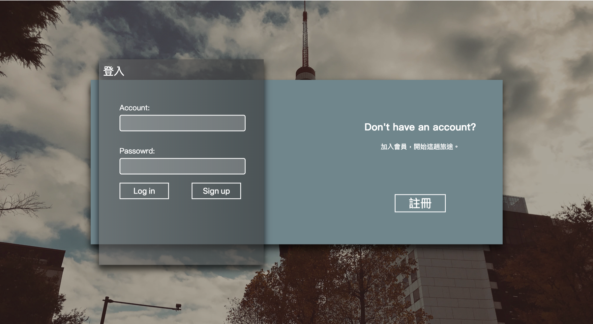
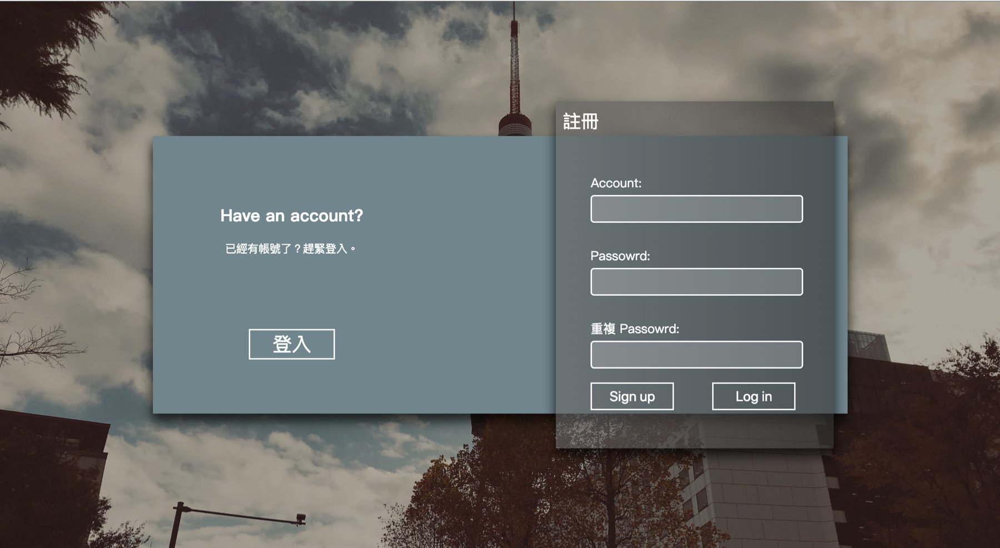

# vue-login-page

Using vue to build a login page

Demo : [https://ycsung.studio/#/login](https://ycsung.studio/#/login)





## Usage

git clone this repository

```bat
git clone "https://github.com/yichunsung/vue-login-page"
```

install npm package

```bat
npm install
```

start express server

```bat
node app.js
```
